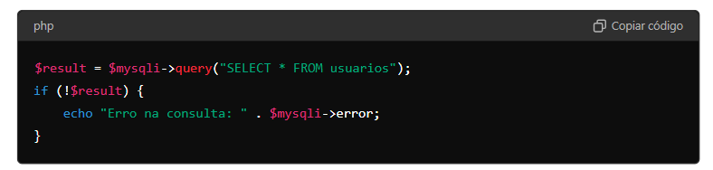
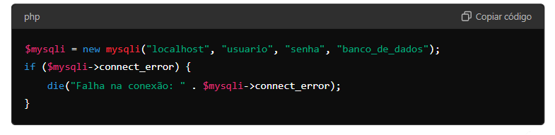

# cadEcommerce 

[CadEcommerce](#cadecommerce)  
[Descrição](#descri%C3%A7%C3%A3o)  
[Introdução](#introdu%C3%A7%C3%A3o)  
[Funcionalidades](#funcionalidades)  
[Tecnologias utilizadas](#tecnologias-utilizdas)  
[Fontes Consultadas](#fontes-consultadas)  
[Autores](#autores)  

 
# Descrição
Este projeto é uma aplicação web para o cadastro e gerenciamento de produtos e marcas. O sistema permite aos usuários cadastrar novos produtos, registrar marcas e visualizar resumos de pedidos. A aplicação é desenvolvida utilizando PHP para o backend e HTML/CSS para o frontend.

# Introdução
O sistema foi criado como parte de um projeto de programação web para facilitar o gerenciamento de produtos e marcas. O objetivo é fornecer uma interface simples e eficaz para realizar operações básicas de CRUD (Create, Read, Update, Delete) sobre produtos e marcas.

# Funcionalidades
- Cadastro de Produtos: Permite o registro de novos produtos, incluindo nome, descrição, estoque, preço, - categoria e marca.

- Cadastro de Marcas: Permite o registro de novas marcas com uma descrição.

- Resumo de Pedido: Exibe um resumo dos pedidos realizados, integrado com o backend PHP para processamento de dados.

- Interface Simples: Inclui uma interface web amigável com navegação entre diferentes seções da aplicação.

# Tecnologias Utilizdas
- PHP: Linguagem de script para o desenvolvimento do backend, responsável pelo processamento dos dados e interação com o banco de dados.

- MySQL: Sistema de gerenciamento de banco de dados relacional utilizado para armazenar informações sobre produtos, marcas e categorias.

- HTML5: Linguagem de marcação para estruturar o conteúdo das páginas web.

- CSS3: Folha de estilos para definir a aparência e o layout das páginas.

- JavaScript: Linguagem de script para adicionar interatividade e funcionalidades dinâmicas à aplicação.

- jQuery: Biblioteca JavaScript usada para simplificar a manipulação do DOM e as requisições AJAX.

# Métodos 
**1.mysqli-** Este é um objeto que representa a conexão com o banco de dados MySQL e contém vários métodos e propriedades para interação com o banco.

[**2.mysqli_query-**](https://www.php.net/manual/pt_BR/mysqli.query.php) Este método executa uma consulta SQL no banco de dados.

[**3.mysqli_close-**](https://www.php.net/manual/pt_BR/mysqli.close.php) Este método encerra a conexão previamente aberta com o banco de dados.

[**4.mysqli_error-**](https://www.php.net/manual/pt_BR/mysqli.error.php) Retorna uma string contendo a descrição do erro mais recente ocorrido na conexão ou na operação MySQLi.

[**5.require_once-**](https://www.php.net/manual/pt_BR/function.require-once.php) É uma construção de PHP usada para incluir e avaliar um arquivo PHP em outro arquivo. 

[**6.mysqli_connect-**](https://www.php.net/manual/pt_BR/function.mysqli-connect.php) É uma função usada para estabelecer uma conexão com um banco de dados MySQL.

[**7.mysqli_fetch_assoc-**](https://www.php.net/manual/pt_BR/mysqli-result.fetch-assoc.php) É usada para obter uma linha de um conjunto de resultados de uma consulta SQL como um array associativo.

[**8.mysqli->set_charset-**](https://www.php.net/manual/en/mysqli.set-charset.php) É usada para definir o conjunto de caracteres (charset) da conexão MySQLi. 

# Estrutura de Arquivos

- HTML: Arquivos .html para a estrutura das páginas da aplicação.

- PHP: Arquivos .php para lógica de backend e interação com o banco de dados.

- CSS: Arquivo style.css para estilos visuais da aplicação.

- JavaScript: Arquivos script.js e jquery-2.1.4.min.js para funcionalidades adicionais e interatividade.

# Fontes Consultadas 
Chat(GPT)  
https://www.php.net/manual/pt_BR/

# Autores
Rayssa Rafaelly Kopinski, Leonardo Rocha
